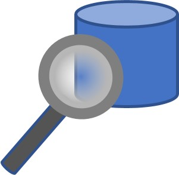

<b style = 'font-size:28px;font-family:Arial;color:#E37C4D'>Basic Jupyter Usage Demonstrations</b>
 
* [Getting Started - Basic Jupyter Navigation](../GettingStarted/GettingStarted/GettingStarted.ipynb)
 If you've never used Jupyter before, this provides basic navigation instructions for executing steps and knowing when a step is running or complete.  

 * [SQL Basics in Jupyter](../GettingStarted/SQL_Plugin_Basics/SQL_Plugin_Basics.ipynb)
 This guide will walk you through writing your first SQL queries in Jupyter.  It uses some of the Vantage system tables as a source for the queries.  
 
* [Getting Started with Jupyter Notebook and Python Pandas](../GettingStarted/GettingStarted_Jupyter_Pandas/GettingStarted_Jupyter_Pandas.ipynb)
 Jupyter notebook is by far the most common modern user interface for analysts, data scientists, and developers.  Python Pandas is one of the most popular data management libraries in the open source ecosystem.  This notebook provides step-by-step instruction on the basics of Jupyter notebook and Python Pandas  
 
* [Basics of the Teradataml Python Package](../GettingStarted/Python_Teradataml_Basics/Python_Teradataml_Basics.ipynb)
 This reviews the basic capabilities of the teradataml package for Vantage: 
1. Connecting to Vantage 
2. Teratada DataFrames 
3. Aggregation, Transformations, and joins. 
4. Export to Pandas  
 
* [Data Dictionary](../UseCases/Data_Dictionary/Data_Dictionary.ipynb)
 This provides an index to all of the databases used by demo notebooks on this machine.  Each demo has stored procedure calls to "get_data" and "remove_data" on their own, however you may be interested in accessing data with your own BI/AI/ML tools and this provides a single place to find that data.   It is also a place where you can manage the space usage on your machine.  
 
 * [Legacy Data Dictionary](../UseCases/Data_Dictionary/Data_Dictionary_Legacy.ipynb)
 When we started developing ClearScape Analytics, we pulled several thousand tables to the cloud that had been used in previous demonstrations or classroom settings.  We created a new data dictionary with only the tables needed for the notebooks we published in ClearScape Analytics Experience.  However people may be looking for data for new note books or to support a demonstration that we hadn't included, so we are making that legacy data source available.  
 
* [Sharing Your Demonstrations](../GettingStarted/Sharing_Demos/Sharing_Demos.ipynb)
 You've just come up with a new and creative way to demonstrate the solution to a business problem with analytics.  Why not share your good work with others?  This provides instructions on structuring your demo so it will be easy to share with others. 

Thank-you for "Paying it forward"  
 

Copyright © 2023 Teradata Corporation
