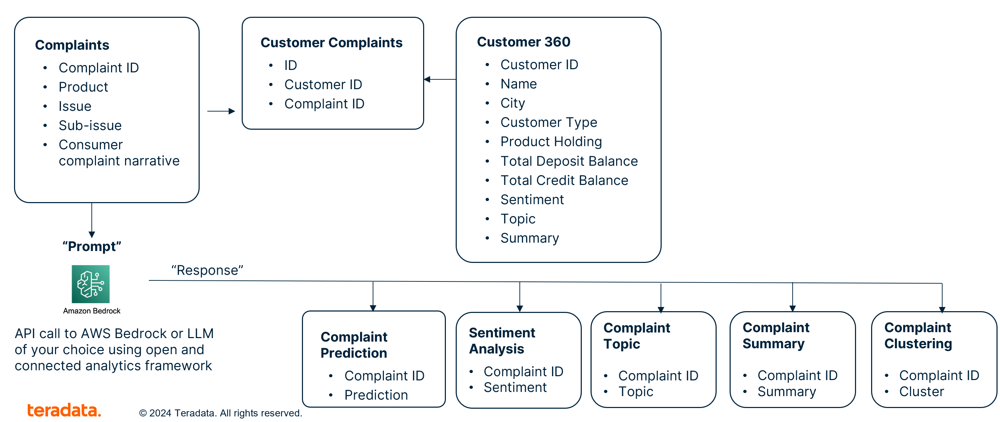

<header>
   

       Customer Complaint Analyzer with Gen-AI
        
       
   

</header>

<!-- Tile 1 -->

    <h2>Customer 360</h2>
    
    
<em>Integrating Complaints Analysis with Customer360 data</em>

    

        <a href="https://nbviewer.org/github/Teradata/jupyter-demos/blob/853384e325e4b616f5b5b371607670380ec00fd1/UseCases/Complaints_Analysis_GenAI/Complaint_Analysis_Customer360.ipynb" style="padding: 10px; background-color: #00233c; color: #FFFFFF; text-decoration: none; border-radius: 5px;">
            Open in nbviewer
        </a>
    

<!-- Tile 5 -->

    <h2>Complaints Classification</h2>
    
    
<em>Complaints Classification using Vantage and Amazon Bedrock</em>

    

        <a href="https://nbviewer.org/github/Teradata/jupyter-demos/blob/7c2fc266e071ddbd092200cc02e46ccdb07cfd16/UseCases/Complaints_Analysis_GenAI/Complaints_Classification.ipynb" style="padding: 10px; background-color: #00233c; color: #FFFFFF; text-decoration: none; border-radius: 5px;">
            Open in nbviewer
        </a>
    

<!-- Tile 2 -->
<!-- 

    <h2>Speech Analysis</h2>
    
    
<em>Speech Analysis with Google Gemini</em>

    

        <a href="https://nbviewer.org/github/Teradata/jupyter-demos/blob/aacb84f43b268451667d0d49fb2ac66db3506ae6/UseCases/Complaints_Analysis_GenAI/Speech_Recognition.ipynb" style="padding: 10px; background-color: #00233c; color: #FFFFFF; text-decoration: none; border-radius: 5px;">
            Open in nbviewer
        </a>
    

 -->

<!-- Tile 3 -->

    <h2>Sentiment Analysis</h2>
    
    
<em>Sentiment Analysis Using Vantage and Amazon Bedrock</em>

    

        <a href="https://nbviewer.org/github/Teradata/jupyter-demos/blob/0780f4aae5fd869d8c19c2668b1275282894b3b1/UseCases/Complaints_Analysis_GenAI/Sentiment_Analysis_Bedrock.ipynb" style="padding: 10px; background-color: #00233c; color: #FFFFFF; text-decoration: none; border-radius: 5px;">
            Open in nbviewer
        </a>
    

<!-- Tile 4 -->

    <h2>Complaints Clustering</h2>
    
    
<em>Complaints Clustering using Vantage and Amazon Bedrock</em>

    

        <a href="https://nbviewer.org/github/Teradata/jupyter-demos/blob/f16f693d3f04d83367c9506a29323443dc32d5d0/UseCases/Complaints_Analysis_GenAI/Complaints_Clustering.ipynb" style="padding: 10px; background-color: #00233c; color: #FFFFFF; text-decoration: none; border-radius: 5px;">
            Open in nbviewer
        </a>
    

<!-- Tile 7 -->

    <h2>Topic Modelling</h2>
    
    
<em>Topic Modelling using Vantage and Amazon Bedrock</em>

    

        <a href="https://nbviewer.org/github/Teradata/jupyter-demos/blob/5f7e3f3cdf7bbb2a5d84a095dec8390e0c7b8af1/UseCases/Complaints_Analysis_GenAI/Topic_Modelling.ipynb" style="padding: 10px; background-color: #00233c; color: #FFFFFF; text-decoration: none; border-radius: 5px;">
            Open in nbviewer
        </a>
    

<!-- Tile 6 -->

    <h2>Complaints Summarization</h2>
    
    
<em>Complaints Summarization Using Vantage and Amazon Bedrock</em>

    

        <a href="https://nbviewer.org/github/Teradata/jupyter-demos/blob/7c2fc266e071ddbd092200cc02e46ccdb07cfd16/UseCases/Complaints_Analysis_GenAI/Complaint_Summarization.ipynb" style="padding: 10px; background-color: #00233c; color: #FFFFFF; text-decoration: none; border-radius: 5px;">
            Open in nbviewer
        </a>
    

<footer style="padding-bottom: 35px; background: #f9f9f9; border-bottom: 3px solid #00233C">
    
ClearScape Analytics™

    

        
Copyright © Teradata Corporation - 2024. All Rights Reserved.

    

</footer>
