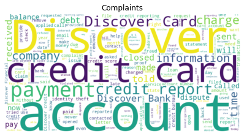
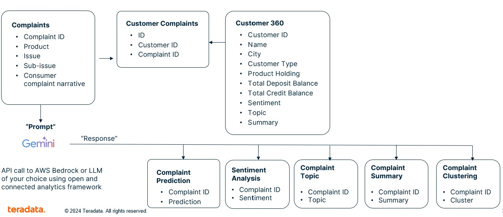

<header>
   

       Customer Complaint Analyzer with Gen-AI
        
       
   

</header>

<!-- Tile 5 -->

    <h2>Complaints Classification</h2>
    
    
<em>Complaints Classification using VantageCloud Lake on Google and Gemini</em>

    

        <a href="https://nbviewer.org/github/Teradata/jupyter-demos/blob/eae8bfc793bdce00be260f5c70bbcba2d37c5621/UseCases/Complaints_Analysis_GenAI/Complaints_Classification_VCL_gemini.ipynb" style="padding: 10px; background-color: #00233c; color: #FFFFFF; text-decoration: none; border-radius: 5px;">
            Open in nbviewer
        </a>
    

<!-- Tile 2 -->
<!-- 

    <h2>Speech Analysis</h2>
    
    
<em>Speech Analysis with Google Gemini</em>

    

        <a href="https://nbviewer.org/github/Teradata/jupyter-demos/blob/aacb84f43b268451667d0d49fb2ac66db3506ae6/UseCases/Complaints_Analysis_GenAI/Speech_Recognition.ipynb" style="padding: 10px; background-color: #00233c; color: #FFFFFF; text-decoration: none; border-radius: 5px;">
            Open in nbviewer
        </a>
    

 -->

<!-- Tile 3 -->

    <h2>Sentiment Analysis</h2>
    
    
<em>Sentiment Analysis using VantageCloud Lake on Google and Gemini</em>

    

        <a href="https://nbviewer.org/github/Teradata/jupyter-demos/blob/eae8bfc793bdce00be260f5c70bbcba2d37c5621/UseCases/Complaints_Analysis_GenAI/Sentiment_Analysis_VCL_gemini.ipynb" style="padding: 10px; background-color: #00233c; color: #FFFFFF; text-decoration: none; border-radius: 5px;">
            Open in nbviewer
        </a>
    

<!-- Tile 4 -->

    <h2>Complaints Clustering</h2>
    
    
<em>Complaints Clustering using VantageCloud Lake on Google and Google Generative AI Embeddings model</em>

    

        <a href="https://nbviewer.org/github/Teradata/jupyter-demos/blob/51d56443a59d96cdb31955a19bc69b1c4aa1f293/UseCases/Complaints_Analysis_GenAI/Complaints_Clustering_VCL_gemini.ipynb" style="padding: 10px; background-color: #00233c; color: #FFFFFF; text-decoration: none; border-radius: 5px;">
            Open in nbviewer
        </a>
    

<!-- Tile 7 -->

    <h2>Topic Modelling</h2>
    
    
<em>Topic Modelling using VantageCloud Lake on Google and Gemini</em>

    

        <a href="https://nbviewer.org/github/Teradata/jupyter-demos/blob/422f84f58ae3f85b76b10a26bb7a35ba6c5f6a12/UseCases/Complaints_Analysis_GenAI/Topic_Modelling_VCL_gemini.ipynb" style="padding: 10px; background-color: #00233c; color: #FFFFFF; text-decoration: none; border-radius: 5px;">
            Open in nbviewer
        </a>
    

<!-- Tile 6 -->

    <h2>Complaints Summarization</h2>
    
    
<em>Complaints Summarization using VantageCloud Lake on Google and Gemini</em>

    

        <a href="https://nbviewer.org/github/Teradata/jupyter-demos/blob/66303acba9084f3fbd3008a5b2b8c5a3c724d9b3/UseCases/Complaints_Analysis_GenAI/Complaints_Summarization_VCL_gemini.ipynb" style="padding: 10px; background-color: #00233c; color: #FFFFFF; text-decoration: none; border-radius: 5px;">
            Open in nbviewer
        </a>
    

<!-- Tile 8 -->

    <h2>Speech Analysis</h2>
    
    
<em>Speech Recognition using VantageCloud Lake on Google and Gemini</em>

    

        <a href="https://nbviewer.org/github/Teradata/jupyter-demos/blob/422f84f58ae3f85b76b10a26bb7a35ba6c5f6a12/UseCases/Complaints_Analysis_GenAI/Speech_Recognition_VCL_gemini.ipynb" style="padding: 10px; background-color: #00233c; color: #FFFFFF; text-decoration: none; border-radius: 5px;">
            Open in nbviewer
        </a>
    

<!-- Tile 1 -->

    <h2>Customer 360</h2>
    
    
<em>Complaints Analysis Integration with Customer360 using VantageCloud Lake on Google and Gemini</em>

    

        <a href="https://nbviewer.org/github/Teradata/jupyter-demos/blob/422f84f58ae3f85b76b10a26bb7a35ba6c5f6a12/UseCases/Complaints_Analysis_GenAI/Complaint_Analysis_Customer360_VCL_gemini.ipynb" style="padding: 10px; background-color: #00233c; color: #FFFFFF; text-decoration: none; border-radius: 5px;">
            Open in nbviewer
        </a>
    

<footer style="padding-bottom: 35px; background: #f9f9f9; border-bottom: 3px solid #00233C">
    
ClearScape Analytics™

    

        
Copyright © Teradata Corporation - 2024. All Rights Reserved.

    

</footer>
