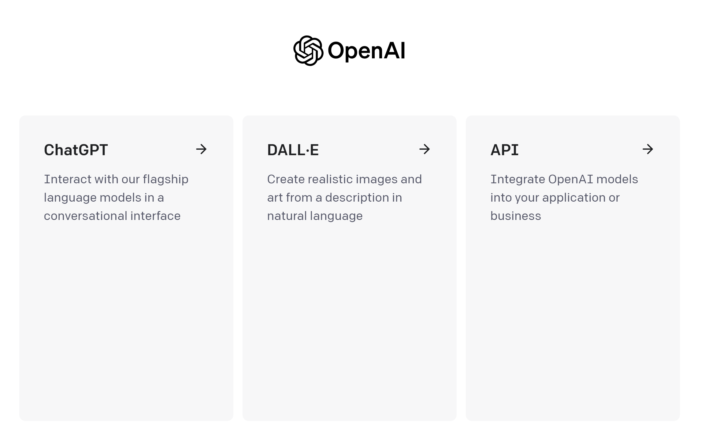
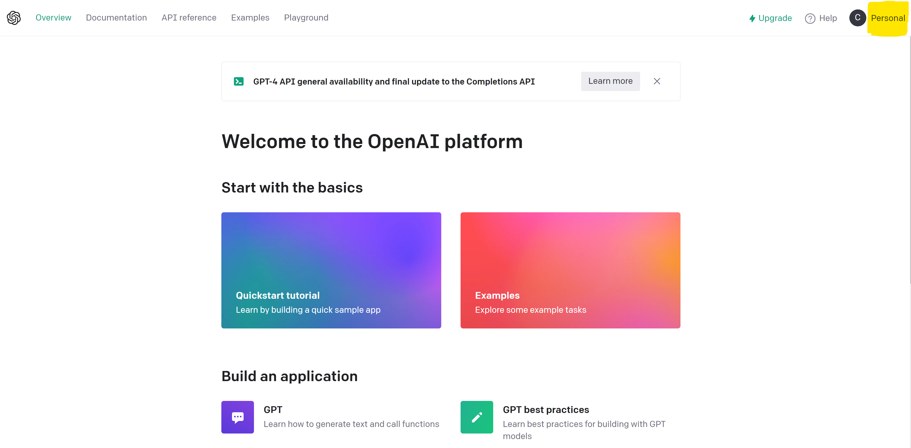
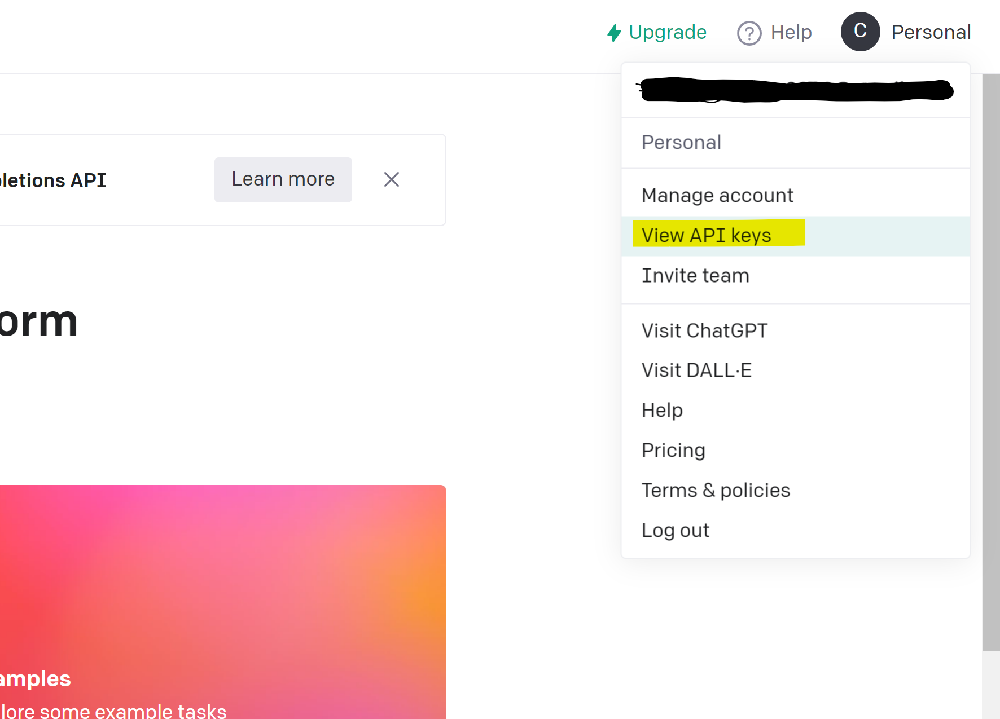
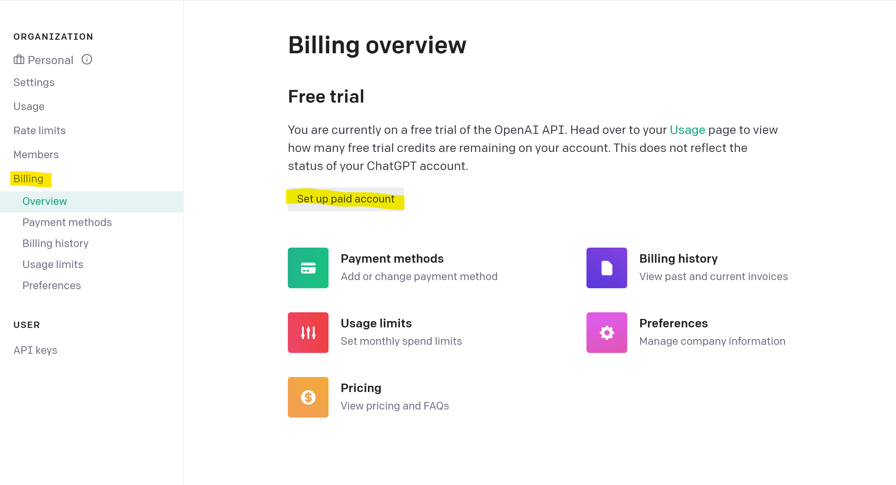
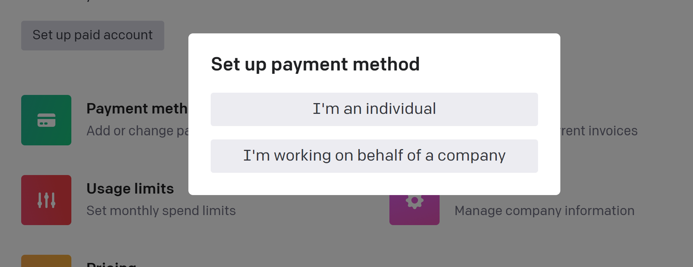
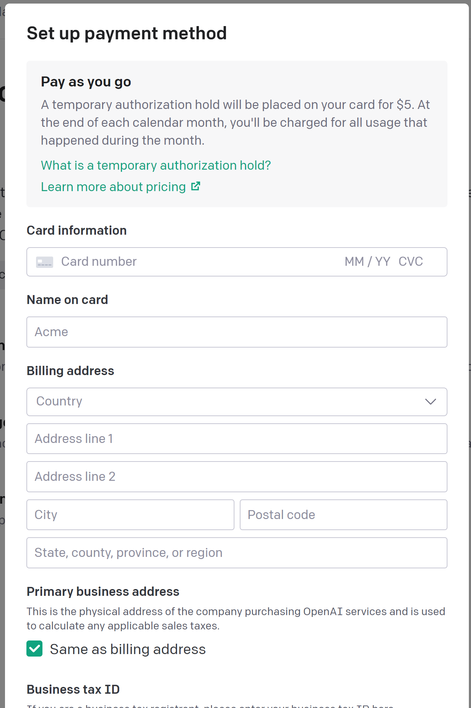
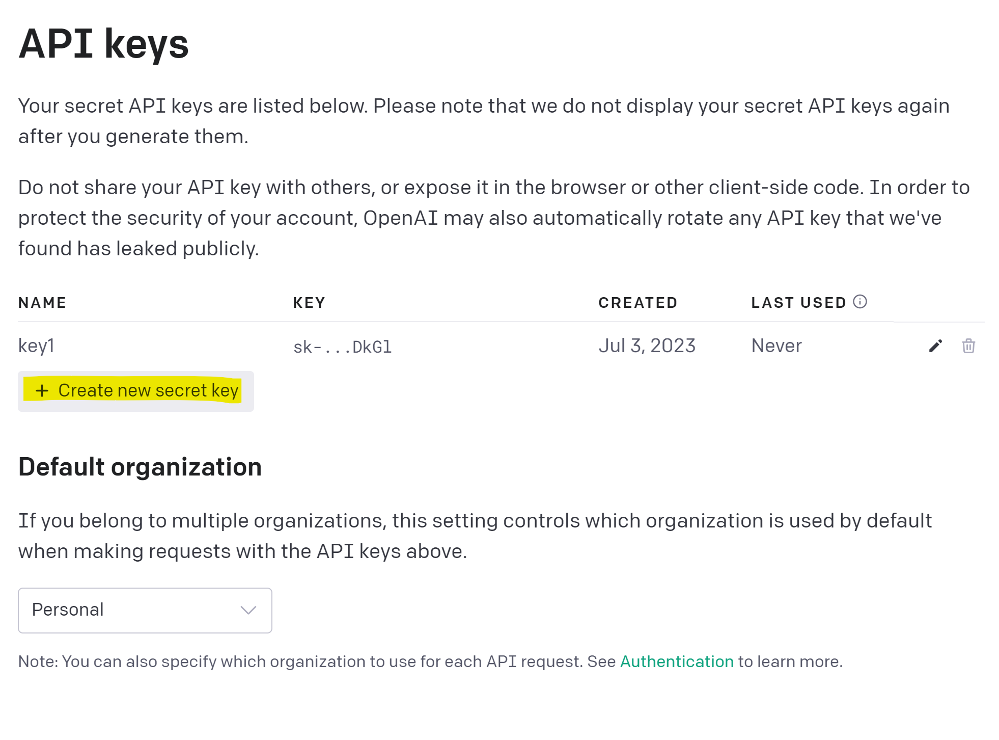
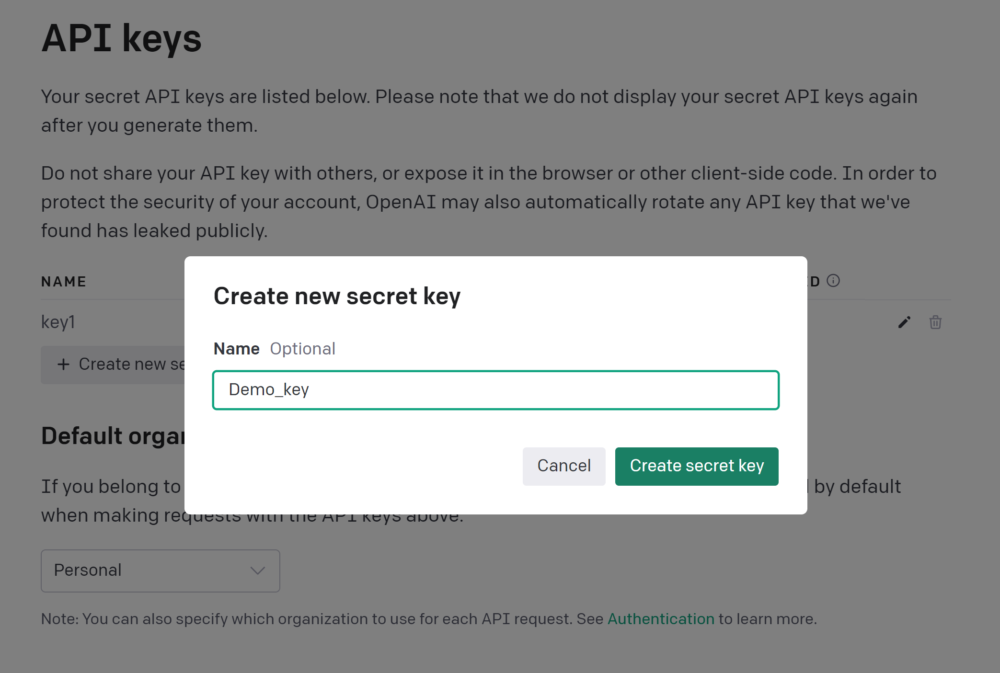
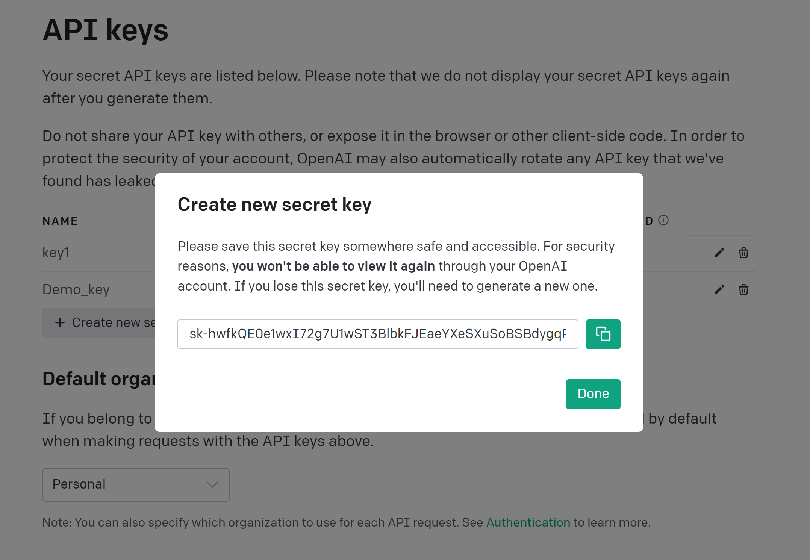

---
jupyter:
  kernelspec:
    display_name: Teradata SQL
    language: Teradata SQL
    name: teradatasql
  language_info:
    codemirror_mode: Teradata SQL
    file_extension: .tdrs
    mimetype: application/vnd.teradata.resultset
    name: Teradata SQL
    version: 16.20
  nbformat: 4
  nbformat_minor: 5
---

<header>
   

       Using ClearScape Analytics with OpenAI
   
       
    

</header>

<b>This is a Beta Release of this notebook!</b>

This should be considered a Beta Release.  Every effort has been made to ensure it's functionality and completeness.  If you discover any issue with any part of this notebook, your suggestions will be reviewed and, if approved, merged in the next round of notebook commits.
 

<b>How to submit a Review of this Notebook</b>

First, please read through and execute the notebook.
 If you think the notebook is fine as it is, great.  Please send us a quick email and let us know. When the notebook is taken out of beta, this paragraph will be removed and the Beta designation the index page will be removed.
 If you find something that you question or you think needs to be changed or if you think it's great as it is:

    
<ol style = 'font-size:16px;font-family:Arial;color:#00233C'>
  <li>Send us an email: <a href="mailto:ClearScapeAnalyticsNotebookReviews@Teradata.com?subject=Beta Notebook Review">Click here.</a></li>
  <li>Please include the name of the notebook in email.</li>
  <li>Include a screen shot or a clear description of the section in the notebook you would like us to look at.</li>
  <li>Paste the screen shot or enter the description of the section into the email.</li>
  <li>Describe how you would change it.</li>
  <li>Send It!</li>
</ol>

If we have any follow-up questions, we'll reach out to you at the return email address. 

    
    

<b>Introduction:</b>

To ensure optimal utilization of the OpenAI API in generative AI notebooks, it is essential to establish the API keys correctly. This concise guide outlines the process of configuring OpenAI API keys for seamless integration across multiple notebooks.  This notebook is called by other notebooks that use OpenAI for get the api key. Please note that the steps for obtaining the API keys are included in this guide as well.

The OpenAI API is a powerful that enables developers to integrate the capabilities of the OpenAI language models into their own applications, products, or services. The OpenAI API allows you to leverage the state-of-the-art natural language processing capabilities of the GPT-3.5 language model, enabling you to create a wide range of intelligent and interactive experiences.

By accessing the OpenAI API, you gain the ability to generate human-like text, answer questions, create conversational agents, perform language translation, assist in writing code, draft emails, write articles, and much more. The API provides a straightforward interface for making requests and receiving responses from the language model, making it easy to incorporate its advanced language capabilities into your own projects.

 

<b>How to Setup OpenAI account and get the API Key</b>

<b>Steps to setup the account:</b>

<ul style = 'font-size:16px;font-family:Arial;color:#00233C'>
<li>Go to the OpenAI website: <a href="https://beta.OpenAI.com/signup">OpenAI.com</a>.</li>
<li>Click on the "Sign up" button.</li>
<li>Enter your email address and password.</li>
<li>Click on the "Create account" button.</li>
<li>You will be sent a verification email. Open the email and click on the verification link.</li>
<li>Once your account is verified, you will be logged in, you will see below screen</li>
</ul>

 

 

<ul style = 'font-size:16px;font-family:Arial;color:#00233C'>
<li>Click on API and you will see all the OpenAI offered services. Click on profile icon in the top right corner</li>
 

 

<ul style = 'font-size:16px;font-family:Arial;color:#00233C'>
<li>Click on View API keys. There will be one default key</li>
 

 

<ul style = 'font-size:16px;font-family:Arial;color:#00233C'>
<li>Now, you have to setup paid account first, Click on Billing to setup paid account.</li>
 

 

<ul style = 'font-size:16px;font-family:Arial;color:#00233C'>
<li>Choose the option: Select Individual if want to use for personal purposes else select second option. </li>
 

 

<ul style = 'font-size:16px;font-family:Arial;color:#00233C'>
<li>Fill out the personal and billing details.</li>
 

 

<ul style = 'font-size:16px;font-family:Arial;color:#00233C'>
<li>Now, Click on Create new secret key to generate the new key.</li>
 

 

<ul style = 'font-size:16px;font-family:Arial;color:#00233C'>
<li>Optional: Specify the key name.</li>
 

 

<ul style = 'font-size:16px;font-family:Arial;color:#00233C'>
<li>Please save this secret key somewhere safe and accessible. For security reasons, you won't be able to view it again through your OpenAI account. If you lose this secret key, you'll need to generate a new one. This is the last step. You can use this key to run generative AI demos.</li>
 

 

<h2>Thank you</h2>

<footer style="padding-bottom:35px; background:#f9f9f9; border-bottom:3px solid #00233C">
    
ClearScape Analytics™

    

        

            Copyright © Teradata Corporation - 2023. All Rights Reserved
        

    

</footer>

